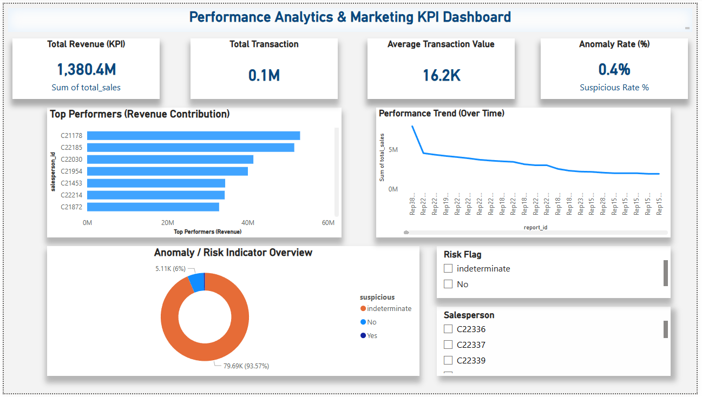

# Cloud-Data-Pipeline-Analytics-Dashboard
**Performance Analytics & KPI Monitoring Dashboard (Power BI)**

An end-to-end cloud-style **data engineering and performance analytics pipeline** built using Docker, FastAPI, PostgreSQL, Python ETL, and Power BI.  
This project analyzes transactional sales data to produce **KPI-driven performance insights, trend analysis, top-performer ranking, and anomaly/risk indicators** — similar to real-world performance marketing and business analytics workflows.

## Project Architecture
Jupyter ETL ---> PostgreSQL (Docker) <--- FastAPI API (Docker)
▲ │
└──── Power BI Dashboard ───┘

## 📊 Power BI Performance Analytics Dashboard



**Dashboard Features:**
- KPI Monitoring: Total Revenue, Total Transactions, Average Transaction Value, Anomaly Rate  
- Top Performers (Revenue Contribution)  
- Performance Trend (Over Time)  
- Anomaly / Risk Indicator Overview  
- Interactive slicers for drill-down analysis

## Objectives
- Ingest raw transactional data and build analytics-ready tables  
- Design KPI models for performance monitoring (revenue, volume, AOV, anomaly rate)  
- Expose performance insights via REST APIs  
- Create an interactive Power BI dashboard for business and marketing stakeholders  
- Detect abnormal/suspicious activity as a quality and risk signal   

This project demonstrates how organizations monitor performance using KPI dashboards.
The same pipeline structure can be applied to digital marketing and campaign analytics, where KPIs such as revenue, growth, top performers, and anomaly detection help stakeholders optimize performance and identify risks.

The dashboard is designed to support:
- Performance monitoring using KPIs and trends  
- Ranking top performers (similar to top channels or campaigns)  
- Detecting abnormal patterns or unusual activity  
- Management-ready reporting for decision-makers

## Tech Stack

| Layer | Technology |
|------|------------|
| Database | PostgreSQL (Docker) |
| Backend | FastAPI + Uvicorn (Docker) |
| ETL | Python (Pandas + Psycopg2) |
| Orchestration | Docker Compose |
| Visualization | Power BI |
| Version Control | Git + GitHub |


## 🔄 Data Pipeline Flow

1️⃣ Load CSV data into Jupyter Notebook  
2️⃣ ETL → Insert into PostgreSQL (`sales_raw_kaggle`)  
3️⃣ Create aggregated table (`sales_by_salesperson`)  
4️⃣ FastAPI exposes analytics endpoints  
5️⃣ Power BI connects to Postgres → Dashboard visualizes insights  


## API Endpoints (FastAPI)

Open interactive docs:

 `http://localhost:8000/docs`

| Method | Endpoint | Description |
|--------|----------|-------------|
| GET | `/health` | API health check |
| GET | `/kpi/top-salespeople?limit=10` | Top performers ranked by revenue |
| GET | `/kpi/suspicious-summary` | Count of suspicious activities |
| GET | `/salesperson/{id}` | Detailed view per salesperson |


## 📂 Project Structure
Cloud_Data_Pipeline_Analytics_Dashboard/
│
├─ api/
│ ├─ main.py
│ └─ requirements.txt
│
├─ etl/
│ └─ 01_etl.ipynb
│
├─ db/
│ └─ init.sql
│
├─ data/
│ └─ sales_raw.csv
│
├─ powerbi_dashboard/
│ └─ Performance_Analytics_Dashboard.png
│
├─ docker-compose.yml
└─ README.md

## Run With Docker

```bash
docker-compose up --build

API will be available at:
http://localhost:8000

Power BI Connection

| Setting  | Value       |
| -------- | ----------- |
| Server   | `localhost` |
| Port     | `5432`      |
| Database | `salesdb`   |
| User     | `postgres`  |
| Password | `postgres`  |

Power BI Connection

Dashboard Highlights

✔ KPI monitoring (Revenue, Transactions, AOV, Anomaly Rate)  
✔ Top Performers (Revenue Contribution)  
✔ Performance Trend (Over Time)  
✔ Anomaly / Risk Indicator Overview  
✔ Interactive slicers for drill-down analysis  

 Key Insights

 A small number of top performers contribute a large share of total revenue, highlighting where performance impact is concentrated.
 The anomaly view helps identify unusual transaction patterns that may require further investigation as part of quality and risk monitoring.
 KPI trends provide a quick overview of overall performance health and changes over time.
 Interactive filters enable drill-down analysis for deeper performance evaluation across entities and segments.

 Real-World Skills Demonstrated

 ✔ Data ingestion and transformation (ETL)
 ✔ SQL-based data modeling for analytics
 ✔ REST API development for data access
 ✔ Containerization and local orchestration with Docker
 ✔ BI reporting and stakeholder-focused insights (Power BI)
 ✔ Version control and project delivery via GitHub

## Relevance to Performance Analytics & Marketing

This project mirrors how performance marketing and communication teams monitor and optimize campaigns using KPI dashboards.  
The same analytics patterns (revenue, volume, trend analysis, top-performer ranking, and quality signals) are used to evaluate campaign performance, customer journey effectiveness, and marketing ROI in real-world consulting and agency environments.

